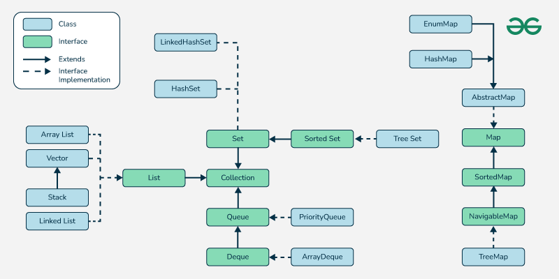

## Collections API in Java

### **Introduction**

- **Collections Framework** is a set of classes and interfaces that implement commonly reusable data structures.
- Found in the `java.util` package.
- Provides standard methods for data manipulation, such as searching, sorting, insertion, deletion, and iteration.

---

### **Core Interfaces**



#### **Collection Interface**

- The root interface for the Collections Framework.
- **Subinterfaces**:
  - **List**: Ordered collection (allows duplicates). Examples: `ArrayList`, `LinkedList`.
  - **Set**: Unordered collection (no duplicates). Examples: `HashSet`, `TreeSet`.
  - **Queue**: Supports element ordering for processing. Examples: `PriorityQueue`, `Deque`.

#### **Map Interface**

- Represents key-value pairs (not part of `Collection` hierarchy).
- Examples: `HashMap`, `TreeMap`, `LinkedHashMap`.

---

### **Commonly Used Classes**

#### **Lists**

- **ArrayList**:
  - Dynamic array; allows random access.
  - Non-synchronized.
- **LinkedList**:
  - Doubly-linked list implementation.
  - Good for frequent insertions and deletions.
- **Vector**:
  - Synchronized version of `ArrayList`.
  - Legacy class.

#### **Sets**

- **HashSet**:
  - Backed by a hash table.
  - No guaranteed order.
- **LinkedHashSet**:
  - Maintains insertion order.
- **TreeSet**:
  - Implements `NavigableSet`, sorted in natural or custom order.

#### **Queues**

- **PriorityQueue**:
  - Elements processed based on priority.
- **Deque (Double-Ended Queue)**:
  - Can be used as a stack or a queue. Examples: `ArrayDeque`.

#### **Maps**

- **HashMap**:
  - Key-value pairs; no ordering.
  - Allows one `null` key and multiple `null` values.
- **LinkedHashMap**:
  - Maintains insertion order.
- **TreeMap**:
  - Sorted by natural ordering or a custom comparator.
- **Hashtable**:
  - Synchronized; legacy class.

---

While using collections, you should specify the type in collections

Without specifying the type, it defaults to using raw types, allowing any Object to be added (both Integer and String in this case).

```java
Collection collection = new ArrayList();
collection.add(1);
collection.add(2);
collection.add(3);
collection.add(4);
collection.add(5);
collection.add("6");
System.out.println(collection);     // [1, 2, 3, 4, 5, 6]

for (Object obj : collection) {
    Integer num = (Integer) obj; // Throws ClassCastException for "6"
}

```

This code **will compile** but will throw an exception during runtime which is harder to detect.

Thus Java introduced Generics in Java 5 to provide type safety.

- Example: `List<Integer> list = new ArrayList<>();`

```java
ArrayList<Integer> list = new ArrayList<>();
list.add(1);
list.add(2);
list.add(3);
list.add(4);
list.add(5);
System.out.println(list);

```

---

### **Synchronization**

- Use `Collections.synchronizedList`, `Collections.synchronizedSet`, etc., to make collections thread-safe.
- Alternative: Use `ConcurrentHashMap` or `CopyOnWriteArrayList`.

---
