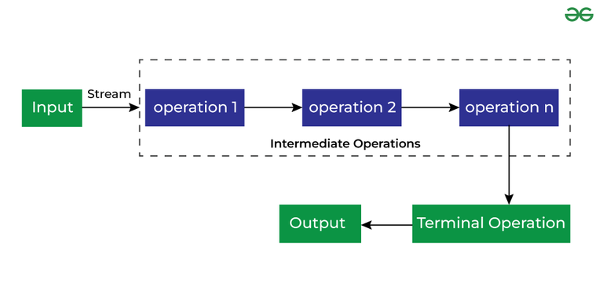

## Stream API

The **Stream API** in Java, introduced in Java 8, is a powerful tool for processing collections of data in a functional programming style. It enables operations such as filtering, mapping, reducing, and more, making the code concise and readable.

A **Stream** in Java is a **sequence of elements from a source that supports aggregate operations** (such as filter, map, and reduce). Streams are not data structures; instead, they process data from sources like collections, arrays, or I/O channels.

There are two types of Operations in Streams:

Intermediate Operations
Terminal Operations



### Creating a Stream

#### From a collection

```java
List<String> names = Arrays.asList("Alice", "Bob", "Charlie");
Stream<String> stream = names.stream();
```

#### From an array

```java
int[] numbers = {1, 2, 3, 4};
IntStream stream = Arrays.stream(numbers);
```

#### Using Stream.of

```java
Stream<String> stream = Stream.of("A", "B", "C");
```

#### From a range:

```java
IntStream range = IntStream.range(1, 5);  // [1, 2, 3, 4]s
```

The **Stream API** in Java, introduced in Java 8, is a powerful tool for processing collections of data in a functional programming style. It enables operations such as filtering, mapping, reducing, and more, making the code concise and readable.

Let’s break this down step by step, starting with the basics.

---

## **What is a Stream in Java?**

A **Stream** in Java is a sequence of elements from a source that supports **aggregate operations** (such as filter, map, and reduce). Streams are **not data structures**; instead, they process data from sources like collections, arrays, or I/O channels.

Key points:

- **Stream operations are lazy:** They don’t execute until a terminal operation (like `collect` or `forEach`) is invoked.
- **Streams don’t store data:** They process data and can be used only once.
- **Streams are functional:** You use lambda expressions for most operations.

---

## **Steps to Use Stream API**

1. **Create a Stream**: You get a stream from a data source (e.g., `List`, `Set`, `Array`).
2. **Perform Intermediate Operations**: Operations like `filter`, `map`, and `sorted` transform the stream.
3. **Perform a Terminal Operation**: Operations like `collect`, `forEach`, and `reduce` produce a result or perform an action.

---

### **Creating Streams**

Here’s how to create streams:

1. From a collection:

   ```java
   List<String> names = Arrays.asList("Alice", "Bob", "Charlie");
   Stream<String> stream = names.stream();
   ```

2. From an array:

   ```java
   int[] numbers = {1, 2, 3, 4};
   IntStream stream = Arrays.stream(numbers);
   ```

3. Using `Stream.of`:

   ```java
   Stream<String> stream = Stream.of("A", "B", "C");
   ```

4. From a range:
   ```java
   IntStream range = IntStream.range(1, 5);  // [1, 2, 3, 4]
   ```

---

### **Intermediate Operations**

These transform the stream into another stream.

1. **`filter`**: Filters elements based on a condition.

   ```java
   List<Integer> numbers = Arrays.asList(1, 2, 3, 4, 5);
   numbers.stream()
          .filter(n -> n % 2 == 0) // Keep only even numbers
          .forEach(System.out::println); // Output: 2, 4
   ```

2. **`map`**: Transforms elements.

   ```java
   List<String> names = Arrays.asList("alice", "bob", "charlie");
   names.stream()
        .map(String::toUpperCase) // Convert to uppercase
        .forEach(System.out::println); // Output: ALICE, BOB, CHARLIE
   ```

3. **`sorted`**: Sorts elements.

   ```java
   List<Integer> numbers = Arrays.asList(5, 1, 4, 3, 2);
   numbers.stream()
          .sorted()
          .forEach(System.out::println); // Output: 1, 2, 3, 4, 5
   ```

4. **`distinct`**: Removes duplicates.

   ```java
   List<Integer> numbers = Arrays.asList(1, 2, 2, 3, 3, 4);
   numbers.stream()
          .distinct()
          .forEach(System.out::println); // Output: 1, 2, 3, 4
   ```

5. **`limit` and `skip`**: Limit the size of the stream or skip elements.
   ```java
   Stream<Integer> numbers = Stream.of(1, 2, 3, 4, 5);
   numbers.limit(3).forEach(System.out::println); // Output: 1, 2, 3
   ```

---

### **Terminal Operations**

These produce a result or side effects and close the stream.

1. **`forEach`**: Iterates over elements.

   ```java
   List<String> names = Arrays.asList("Alice", "Bob", "Charlie");
   names.stream().forEach(System.out::println);
   ```

2. **`collect`**: Collects elements into a collection or string.

   ```java
   List<String> names = Arrays.asList("Alice", "Bob", "Charlie");
   List<String> upperNames = names.stream()
                                  .map(String::toUpperCase)
                                  .collect(Collectors.toList());
   System.out.println(upperNames); // Output: [ALICE, BOB, CHARLIE]
   ```

3. **`reduce`**: Reduces elements to a single value.

   ```java
   List<Integer> numbers = Arrays.asList(1, 2, 3, 4);
   int sum = numbers.stream()
                    .reduce(0, Integer::sum); // Adds all numbers
   System.out.println(sum); // Output: 10
   ```

4. **`count`**: Counts the elements.

   ```java
   List<String> names = Arrays.asList("Alice", "Bob", "Charlie");
   long count = names.stream().count();
   System.out.println(count); // Output: 3
   ```

5. **`findFirst`**: Finds the first element.
   ```java
   List<String> names = Arrays.asList("Alice", "Bob", "Charlie");
   String first = names.stream().findFirst().orElse("None");
   System.out.println(first); // Output: Alice
   ```

---

### **Working Example: Processing a List**

```java
import java.util.*;
import java.util.stream.*;

public class StreamExample {
    public static void main(String[] args) {
        List<String> names = Arrays.asList("Alice", "Bob", "Charlie", "David");

        // Find names that start with 'A' and convert to uppercase
        List<String> result = names.stream()
                                   .filter(name -> name.startsWith("A"))
                                   .map(String::toUpperCase)
                                   .collect(Collectors.toList());

        System.out.println(result); // Output: [ALICE]
    }
}
```

---

### **Parallel Streams**

You can process streams in parallel to improve performance:

```java
List<Integer> numbers = Arrays.asList(1, 2, 3, 4, 5);
numbers.parallelStream()
       .map(n -> n * n)
       .forEach(System.out::println);
```

> Use parallel streams only when tasks are independent and not I/O-intensive.
